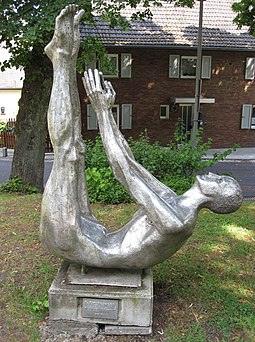

+++
title = "Wasserspringen und Turmspringen"
date = "2025-02-21"
draft = false
pinned = false
tags = ["Diving", "Wassersportart"]
image = "oip.jpg"
description = "Wasserspringen"
footnotes = "Naja danke Wikipedia für die Texte"
+++


Sportart Wasserspringen


# Wasserspringen

Das **Wasserspringen** ist eine [Wassersportart](https://de.wikipedia.org/wiki/Wassersport), bei der es darum geht, aus unterschiedlichen Höhen und mit verschiedenen Techniken möglichst elegant ins Wasser zu springen. Dieser Wettkampfsport ist mit mehreren Disziplinen seit 1904 Bestandteil der Olympischen Spiele. Unterschieden werden die Disziplinen Kunstspringen (1-m- und 3-m-Brett), Turmspringen (5-m-, 7,5-m- und 10-m-Turm) und Synchronspringen (3-m-Brett und 10-m-Turm). Wasserspringen ist auch ein beliebter Freizeitsport, der in manchen Schwimm- und Freizeitbädern ausgeübt werden kann. Als wichtiger Bestandteil der meisten Schwimmabzeichen und des Rettungsschwimmens hat Wasserspringen auch eine sicherheitsrelevante Bedeutung.

Eine Extremsportvariante des Wasserspringens ist das **Klippenspringen**. Dabei springen die Sportler von Felsklippen aus über zehn Metern Höhe in offene Gewässer. Sie verbindet Techniken des Turmspringens mit den Anforderungen, die die freie Natur an die Sportler stell.

## Geschichte

Im 8. Jahrhundert vor Christus wird das Wasserspringen im antiken **Griechenland** in Homers Odyssee erstmals erwähnt. Allerdings zählte es eher zur militärischen Ausbildung denn als sportlicher Wettkampf. Auch bei Römern und Germanen zählte das Springen mit anschließendem Tauchen als militärisches Mittel. Ein erstes Bild eines Wasserspringers fand man in Paestum, ungefähr aus dem Jahr 475 vor Christus. Das Tomba del Tuffatore (Grab des Tauchers) zeigt einen Mann, der anmutig von einer Plattform springt. Das Bild soll bildhaft den Verlauf des Lebens, von der Geburt bis zum Tod, symbolisieren.

Wasserspringen als moderner **Wettkampfsport** entwickelte sich ab dem 18. Jahrhundert in Deutschland und Schweden. In Deutschland ist die Entwicklung mit der Turnbewegung von Turnvater Jahn und GutsMuths verknüpft. Die Halloren, bei denen das Springen sportlicher Brauch wurde, zählten zu den ersten, die in Wettkämpfen vor Zuschauern ihre Sprünge zeigten. Gesprungen wurde zumeist von Brücken in die Saale. Der weltweit erste Verein für Wasserspringen wurde 1840 vom Halloren Tichy gegründet und hieß Tichy’sche Frösche. Da in dieser Zeit mehrere Schwimmbäder entstanden und das Springen dort ungefährlicher war als in offenen Gewässern, verbreitete sich das Wasserspringen. In Schweden wurden zu dieser Zeit Holzgerüste an Seen und Küsten erbaut, von denen Sportler ihre Sprünge zeigten. 1899 fand in Schweden die erste, allerdings inoffizielle, Weltmeisterschaft statt. Mit der Aufnahme von Wasserspringen in das Programm der **Olympischen Spiele** 1904 verbreitete sich die Sportart auch in anderen Ländern.

Seit der Gründung des Deutschen Schwimm-Verbands im Jahr 1886 finden deutsche Meisterschaften statt; seit 1921 (nur Kunstspringen) bzw. 1933 (auch Turmspringen) nehmen an diesen auch Frauen teil. Der internationale Dachverband, die FINA, wurde 1908 gegründet.

### Wasserspringen als Freizeitsport

In den meisten öffentlichen Schwimm- und Freizeitbädern steht den Besuchern ein Sprungbrett, manchmal auch ein Sprungturm und ein spezielles Sprungbecken, zur Verfügung. Im Gegensatz zum Wettkampfspringen, bei dem Eleganz und sauberes Eintauchen im Vordergrund stehen, zählt für mehrere Freizeitspringer vor allem der Mut zum Absprung, aus größeren Höhen auch das Gefühl des freien Falls. Ein beliebter Sprung ist die sogenannte Arschbombe, bei der man mit großer Oberfläche auf das Wasser trifft, sodass eine hohe Fontäne entsteht.

In Deutschland gehört Wasserspringen zum Bestandteil vieler Schwimmabzeichen. Beim Seepferdchen ist ein Sprung vom Beckenrand vorgeschrieben, für den Deutschen Schwimmpass Sprünge aus bis zu 3 Metern Höhe. Auch für das Erlangen des Rettungsschwimmabzeichens müssen Kopf- und Startsprünge gezeigt werden.

Ähnlich ist die Situation in Österreich. Für die Schwimmabzeichen der Arbeitsgemeinschaft Österreichisches Wasserrettungswesen (ARGE ÖWRW) müssen bestimmte Anforderungen im Wasserspringen erfüllt werden. Zum Beispiel ist für den Frühschwimmer ein Sprung vom Beckenrand, für den Freischwimmer ein 1-m-Kopfsprung bzw. 3-m-Fußsprung und sind für den Fahrten- und Allroundschwimmer Kopfstartsprünge vorgeschrieben.In der Schweiz ist Wasserspringen Bestandteil im Schwimmunterricht an Schulen. Die Kinder und Jugendlichen können im Rahmen der Schwimmtests spezielle Tests für Wasserspringen machen und über acht Stufen entsprechende Stoffabzeichen erwerben. Über die staatliche Organisation Jugend und Sport wird Wasserspringen im Breitensport gefördert. Ab der fünften Stufe benötigt man bei einem Wettkampf eine bestimmte Punktzahl, um das Abzeichen zu erwerben.

Zu den Gefahren des Wasserspringens zählen Kopfsprünge in unbekannte Gewässer. Durch falsch eingeschätzte Wassertiefe oder unter der Wasseroberfläche liegende Teile kommt es immer wieder zu schweren Verletzungen, insbesondere Querschnittlähmungen, und zu Todesfällen.\[3]

