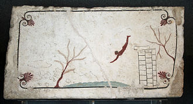

+++
title = "The best website of the world"
date = "2025-02-21"
draft = false
pinned = false
tags = ["Lilo", "Example"]
image = "https://th.bing.com/th/id/OIP.OUWozWwNRfSKuEFjjZUb9wHaEW?rs=1&pid=ImgDetMainhttps://th.bing.com/th/id/OIP.OUWozWwNRfSKuEFjjZUb9wHaEW?rs=1&pid=ImgDetMain"
description = "In diesem Artikel werden Möglichkeiten aufgezeigt für das Verfassen von Blogeinträgen."
footnotes = "In der Fusszeile können zum Beispiel Bildquellen angegeben werden. Dieser Text ist abgetrennt durch eine Linie und etwas kleiner."
+++


Sportart Wasserspringen


# Wasserspringen

Das **Wasserspringen** ist eine Wassersportart, bei der es darum geht, aus unterschiedlichen Höhen und mit verschiedenen Techniken möglichst elegant ins Wasser zu springen. Dieser Wettkampfsport ist mit mehreren Disziplinen seit 1904 Bestandteil der Olympischen Spiele. Unterschieden werden die Disziplinen Kunstspringen (1-m- und 3-m-Brett), Turmspringen (5-m-, 7,5-m- und 10-m-Turm) und Synchronspringen (3-m-Brett und 10-m-Turm). Wasserspringen ist auch ein beliebter Freizeitsport, der in manchen Schwimm- und Freizeitbädern ausgeübt werden kann. Als wichtiger Bestandteil der meisten Schwimmabzeichen und des Rettungsschwimmens hat Wasserspringen auch eine sicherheitsrelevante Bedeutung.

Eine Extremsportvariante des Wasserspringens ist das **Klippenspringen**. Dabei springen die Sportler von Felsklippen aus über zehn Metern Höhe in offene Gewässer. Sie verbindet Techniken des Turmspringens mit den Anforderungen, die die freie Natur an die Sportler stellt.



## Geschichte

Im 8. Jahrhundert vor Christus wird das Wasserspringen im antiken Griechenland in Homers Odyssee erstmals erwähnt. Allerdings zählte es eher zur militärischen Ausbildung denn als sportlicher Wettkampf. Auch bei Römern und Germanen zählte das Springen mit anschließendem Tauchen als militärisches Mittel. Ein erstes Bild eines Wasserspringers fand man in Paestum, ungefähr aus dem Jahr 475 vor Christus. Das Tomba del Tuffatore (Grab des Tauchers) zeigt einen Mann, der anmutig von einer Plattform springt. Das Bild soll bildhaft den Verlauf des Lebens, von der Geburt bis zum Tod, symbolisieren.

Wasserspringen als moderner Wettkampfsport entwickelte sich ab dem 18. Jahrhundert in Deutschland und Schweden. In Deutschland ist die Entwicklung mit der Turnbewegung von Turnvater Jahn und GutsMuths verknüpft. Die Halloren, bei denen das Springen sportlicher Brauch wurde, zählten zu den ersten, die in Wettkämpfen vor Zuschauern ihre Sprünge zeigten. Gesprungen wurde zumeist von Brücken in die Saale. Der weltweit erste Verein für Wasserspringen wurde 1840 vom Halloren Tichy gegründet und hieß Tichy’sche Frösche. Da in dieser Zeit mehrere Schwimmbäder entstanden und das Springen dort ungefährlicher war als in offenen Gewässern, verbreitete sich das Wasserspringen. In Schweden wurden zu dieser Zeit Holzgerüste an Seen und Küsten erbaut, von denen Sportler ihre Sprünge zeigten. 1899 fand in Schweden die erste, allerdings inoffizielle, Weltmeisterschaft statt. Mit der Aufnahme von Wasserspringen in das Programm der Olympischen Spiele 1904 verbreitete sich die Sportart auch in anderen Ländern.

Seit der Gründung des Deutschen Schwimm-Verbands im Jahr 1886 finden deutsche Meisterschaften statt; seit 1921 (nur Kunstspringen) bzw. 1933 (auch Turmspringen) nehmen an diesen auch Frauen teil. Der internationale Dachverband, die FINA, wurde 1908 gegründet.

### Wasserspringen als Freizeitsport

In den meisten öffentlichen Schwimm- und Freizeitbädern steht den Besuchern ein Sprungbrett, manchmal auch ein Sprungturm und ein spezielles Sprungbecken, zur Verfügung. Im Gegensatz zum Wettkampfspringen, bei dem Eleganz und sauberes Eintauchen im Vordergrund stehen, zählt für mehrere Freizeitspringer vor allem der Mut zum Absprung, aus größeren Höhen auch das Gefühl des freien Falls. Ein beliebter Sprung ist die sogenannte Arschbombe, bei der man mit großer Oberfläche auf das Wasser trifft, sodass eine hohe Fontäne entsteht.

In Deutschland gehört Wasserspringen zum Bestandteil vieler Schwimmabzeichen. Beim Seepferdchen ist ein Sprung vom Beckenrand vorgeschrieben, für den Deutschen Schwimmpass Sprünge aus bis zu 3 Metern Höhe. Auch für das Erlangen des Rettungsschwimmabzeichens müssen Kopf- und Startsprünge gezeigt werden.

Ähnlich ist die Situation in Österreich. Für die Schwimmabzeichen der Arbeitsgemeinschaft Österreichisches Wasserrettungswesen (ARGE ÖWRW) müssen bestimmte Anforderungen im Wasserspringen erfüllt werden. Zum Beispiel ist für den Frühschwimmer ein Sprung vom Beckenrand, für den Freischwimmer ein 1-m-Kopfsprung bzw. 3-m-Fußsprung und sind für den Fahrten- und Allroundschwimmer Kopfstartsprünge vorgeschrieben.In der Schweiz ist Wasserspringen Bestandteil im Schwimmunterricht an Schulen. Die Kinder und Jugendlichen können im Rahmen der Schwimmtests spezielle Tests für Wasserspringen machen und über acht Stufen entsprechende Stoffabzeichen erwerben. Über die staatliche Organisation Jugend und Sport wird Wasserspringen im Breitensport gefördert. Ab der fünften Stufe benötigt man bei einem Wettkampf eine bestimmte Punktzahl, um das Abzeichen zu erwerben.

Zu den Gefahren des Wasserspringens zählen Kopfsprünge in unbekannte Gewässer. Durch falsch eingeschätzte Wassertiefe oder unter der Wasseroberfläche liegende Teile kommt es immer wieder zu schweren Verletzungen, insbesondere Querschnittlähmungen, und zu Todesfällen.\[3]

#### Überschrift 4

Auch Überschrift 4 muss im `Markdown`-Modus erstellt werden: `#### Überschrift 4`

## Weitere Textformatierungen

Am besten einfach alle Formatierungsmöglichkeiten in der Toolbar von `Inhalt` mal ausprobieren.

### Fett und Kursiv

Natürlich gibt es auch **fett** und *kursiv*.

### Links

[So können Links angegeben werden](https://www.lilo.blog). Wenn man in den `Markdown`-Modus wechselt, sieht man auch, welcher Link hinterlegt worden ist.

### Zitate

> «Zitate können hervorgehoben werden.»
>
> *Autor mit [Link zur Quelle](https://www.lilo.blog)*

Die Quellenangabe muss *kursiv* geschrieben werden, damit sie als Fusszeile erkannt wird.

### Liste

So sieht eine Liste aus:

* Nam de isto magna dissensio est.
* Mihi, inquam, qui te id ipsum rogavi?
* Haec et tu ita posuisti, et verba vestra sunt.
* Idem fecisset Epicurus, si sententiam hanc, quae nunc Hieronymi est, coniunxisset cum Aristippi vetere sententia.

### Nummerierte Liste

Und so eine nummerierte Liste:

1. Nam de isto magna dissensio est.
2. Mihi, inquam, qui te id ipsum rogavi?
3. Haec et tu ita posuisti, et verba vestra sunt.
4. Idem fecisset Epicurus, si sententiam hanc, quae nunc Hieronymi est, coniunxisset cum Aristippi vetere sententia.

## Bilder

Bilder werden mit dem `+`-Symbol eingefügt.


**Empfehlung für Bilder**: Meist empfiehlt sich, ein Bild ganz zuoberst im `Inhalt`-Feld einzufügen. Zusätzlich sollte man dieses auch im `Bild`-Feld angeben, damit es in der Blogübersicht erscheint.

### Tipps zu Bildgrössen

Ein Richtwert für Bilder ist, dass diese wenn möglich nicht grösser als `400kb` sein sollten. Man kann sie so verkleinern, dass die Breite höchstens `1200px` gross ist. Dies ist für die meisten Bildschirme mehr als genug.

### Bildunterschrift

Wenn bei einem Bild ein `ALT TEXT` erfasst wird, so wird dieser als Bildunterschrift im Artikel angezeigt.

## Horizontale Linie

Eine Horizontale Linie kann man entweder durch ein `<hr>` einfügen oder indem man im `Markdown`-Modus drei Striche `---` einfügt. So sieht die Linie aus:

- - -

## Lead


Oft haben Artikel unterhalb des Haupttitels einen einführenden Lead, der etwas grösser dargestellt wird.


``\
Ein Lead steht zwischen zwei solchen Blöcken.\
``

## Kasten


In dieser Box können Texte, Bilder, Videos oder andere Inhalte dargestellt werden.


``\
Der Inhalt einer Box muss wie hier von zwei Blöcken umgeben werden.\
``


Wird ein Titel angegeben, so kann die Box ausgeklappt werden.

Dies eignet sich auch für längere Inhalte.


Auch Bilder können in eine Box gepackt werden.


``\
Wird ein Titel angegeben, so kann die Box ausgeklappt werden.\
``

## Video, Audio und andere Medien einbetten

Es kann auch `HTML-Code` eingefügt werden. Manchmal geht dies etwas einfacher, wenn man dazu in den `Markdown`-Modus wechselt.

Damit können zum Beispiel Filme, Audiodateien oder Karten eingebettet werden. Meist sind auf den entsprechenden Plattformen (YouTube, Vimeo, Google Maps, etc.) entsprechende Code-Ausschnitte vorbereitet, die man direkt in den Blog einfügen kann. Am besten auf der jeweiligen Plattform nach einem Knopf für `embed` oder `share` suchen.

Bei Videos ist es ideal, wenn sie sich automatisch **an die Bildschirmgrösse anpassen**. Dies geht am einfachsten mit den hinterlegten YouTube- und Vimeo-Codes:

### YouTube einbetten

Einbetten von YouTube-Videos mit dem Code: ``

(Die `video_id` steht bei jedem YouTube-Video in der Browser-URL.)



### Vimeo einbetten

Einbetten von Vimeo-Videos geht mit dem Code: ``



### Code und Code-Blöcke

Mit dem Code-Symbol `<>` können Wörter auf `diese Art` hervorgehoben werden. Dies wird zum Beispiel für Tastenkombinationen wie `ctrl+s` oder für `Programmiercode` verwendet. Auch Math-Formeln können so ausgedrückt werden: `y = mx + b`.

Für längere solche Abschnitte verwendet man am besten das Code-Block-Symbol. Damit wird ein solcher Block erstellt:

```
const sun1 = "sun" + "il";
const sun2 = "su" + "n" + "il";
sun1 === sun2;
```

## Spass haben

😀 Viel Spass mit deinem Blog!